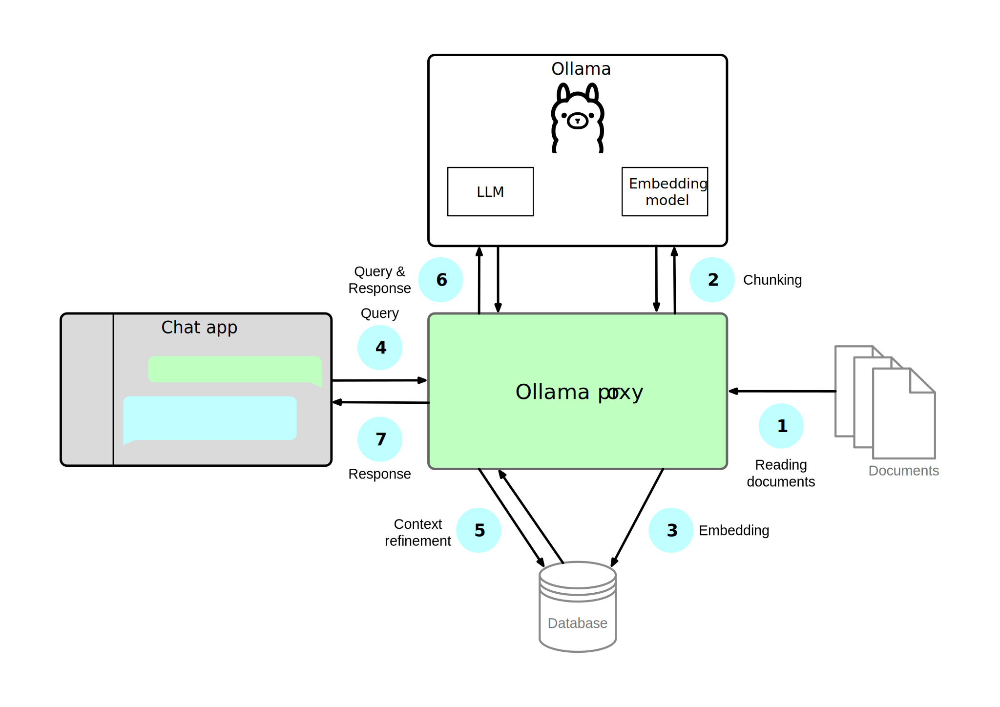

# Knowledge Base for Ollama

This command-line tool builds an offline retrieval-augmented generation (RAG) system for large language models (LLMs). It builds a knowledge base from your input documents and uses it to retrieve relevant information in response on your queries (retrieval). This retrieved information, combined with your original query, is then used to generate a more informed and accurate response (generation). Think of it as giving a chatbot access to a library before it answers your question. This allows it to deliver more factual and contextually rich answers than an LLM relying solely on its pre-trained knowledge. The tool integrates an Ollama proxy, enabling interaction through any chat interface compatible with Ollama.

## Background

A RAG system works by breaking the documents into small, manageable pieces called chunks or nodes. These nodes are then embedded, i.e. converted into vector representations, and stored in a vector database.  When a user asks a question, the system retrieves the most relevant nodes from the database and feeds them to the LLM along with the query.



## Installation

### Prerequisites

In order to use the tool, you will need to have [Ollama](https://ollama.com) and Python 3 installed. You can use any Python distribution. My favourite is [Miniforge3](https://github.com/conda-forge/miniforge).

In addition, you will need a chat interface that allows manually setting the Ollama server port address. I have used [Enchanted](https://github.com/gluonfield/enchanted) on Mac for the simple reason that it is available through App Store. I have also tried [Ollamate](https://github.com/humangems/ollamate), an Electron-based cross-platform application that also supports macOS 12, in case you have an older Mac. One of the more popular cross-platform applications is [Open WebUI](https://github.com/open-webui/open-webui), a rather feature-rich chat interface. It even has RAG features built right into it, so you don't necessarily need this Ollama proxy to build your knowledge base. I am told it can be a bit resource-intensive, though. In addition to the ones mentioned here, there are many other options. Just search for Ollama chat client and see which one you like the most.

### Installation

It is highly recommended that you create a Python environment that contains only the libraries and tools needed. In any Python distribution that uses the `conda` package and environment manager (e.g., Miniforge, Anaconda, Miniconda), you can create an environment called *llm* with Python 3.13 and a faster alternative to `conda`—called `mamba`—using the following command:
```
conda create -n llm python=3.13 mamba
```
You can activate the newly created environment by entering:
```
mamba activate llm
```
Normally we would install all packages using `mamba`, but unfortunately the Ollama-related LlamaIndex packages are not available via official channels yet. Therefore, we will use `pip` to install them.
```
mamba install compilers chromadb ollama flask waitress platformdirs
pip install llama-index-vector-stores-chroma llama-index-embeddings-ollama llama-index-llms-ollama 
```

## Usage

You can get a brief summary of the available options by typing the command `./knowledgebase.py` on its own or with argument `-h` or `--help`:
```
usage: knowledgebase.py [-h] {list,generate} ...

An offline retrieval-augmented generation (RAG) system accessible as a proxy
Ollama server

positional arguments:
  {list,generate}
    list           list available models
    generate       generate knowledge base

options:
  -h, --help       show this help message and exit
```

The `list` option lists the models available via your Ollama installation. These are the LLMs you have downloaded locally on your machine. The `generate` option will generate the knowledge base and run the Ollama proxy. For example,
```
./knowledgebase.py generate --model gemma3:12b --embedding nomic-embed-text --port 11800 documentdir
```
will generate a knowledgebase from the files in directory *documentdir* using embedding model *nomic-embed-text*, and run the Ollama proxy in port 11800 using model *gemma3:12b* (Google's open model Gemma 3 with 12 billion parameters). The options `--model`, `--embedding` and `--port` can be shortened to `-m`, `-e` and `-p`, respectively. The full syntax is as follows:
```
usage: knowledgebase.py generate [-h] [-m MODEL] [-e EMBEDDING] [-d DBPATH]
                                 [-n NAME] [-p PORT] [--debug] [-R]
                                 [-x EXCLUDE]
                                 [path ...]

options:
  -h, --help            show this help message and exit
  -m, --model MODEL     name of the model to use
  -e, --embedding EMBEDDING
                        name of the embedding model to use
  -d, --dbpath DBPATH   path to the database directory (default:
                        "./chroma_db")
  -n, --name NAME       name of the database and the proxy (default:
                        "knowledge_base_db")
  -p, --port PORT       port number for the Ollama proxy (if omitted, the
                        proxy is not started)
  --debug               print debug information

Files:
  These arguments specify the documents to include in the knowledge base. If
  omitted, the proxy uses the existing database as is.

  path                  document file(s) or a directory to add to the database
  -R, --recursive       recurse into directories
  -x, --exclude EXCLUDE
                        ignore files that match the exclude pattern
```

Once the Ollama proxy is running, you can access it in your chat interface as *http&colon;//localhost:&lt;port&gt;*, where *&lt;port&gt;* is the port number given as the `-p` or `--port` argument (11800 in the example above). If the argument is omitted, the tool only adds the given documents to the database without starting the proxy.

You can list all the files you want to add (using wildcards, if necessary), or you can add the contents of an entire directory. The [supported file types](https://docs.llamaindex.ai/en/stable/module_guides/loading/simpledirectoryreader/#supported-file-types) include PDF and text files, Word and PowerPoint documents, CSV tables and even some image and video formats. For example, to add all files in *documentdir* and its subdirectories, except files with extension *.csv*, you can use the following command:
```
./knowledgebase.py generate -e nomic-embed-text -R -x "*.csv" documentdir 
```

## Limitations

### Performance

The efficiency and accuracy of a RAG system depend on the chunk size and overlap used in the node creation. Larger chunks have the advantage of potentially containing all the necessary context for a query within a single node. However, they also present challenges: embedding and storing larger chunks requires more computational resources, and they increase the risk of including irrelevant information that can confuse the language model and lower the quality of the generated response. To ensure context is maintained when using larger chunks, some overlap between consecutive nodes is usually necessary. This overlap determines how many tokens are shared between each chunk. Finding the ideal chunk size and overlap depends on the specific documents being used and the capabilities of the embedding model. Beyond chunk size and overlap, the number of top-ranked embeddings retrieved also impacts performance. Currently, adjusting these parameters is not possible without modifying the source code, but I plan to add support for this. I might even add an option to determine the optimal parameters automatically.

The proxy does not currently support streaming responses. Instead, the entire answer is returned as one block. Since you cannot start reading the answer before the entire answer is ready, interacting with the LLM is slower than without the proxy. This will be addressed in future versions of the tool.

### API Support

Currently, the tool supports the following Ollama API endpoints:
- [x] Generating a completion
- [x] Generating a chat completion
- [ ] Creating a model
- [ ] Checking if a blob exists (new)
- [ ] Pushing a blob (new)
- [x] Listing local models
- [x] Showing model information
- [ ] Copying a model
- [ ] Deleting a model
- [ ] Pulling a model
- [ ] Pushing a model
- [ ] Generating embeddings
- [x] Listing running models
- [ ] Getting Ollama version (new)

This means that if your chat interface supports, e.g., retrieving models from the Ollama library, you cannot currently use this feature via the proxy. Instead, you will need to use `ollama pull` command or point the chat interface temporarily to the Ollama instance instead of the proxy. Adding support for all endpoints is fairly easy, if it is deemed necessary. The endpoints marked as *new* will not be added until the Ollama Python library includes them.

### Installation

The installation process might be a bit too involved for someone not so technically inclined. In fact, the instructions are written for Unix-like operating systems, such as macOS, Linux or Windows Subsystem for Linux (WSL), and I haven't even checked how one would go about installing the tool on a Windows system without WSL. I will do that in the near future, but ideally the tool would be packaged into a platform-specific installer similarly to Ollama. 

